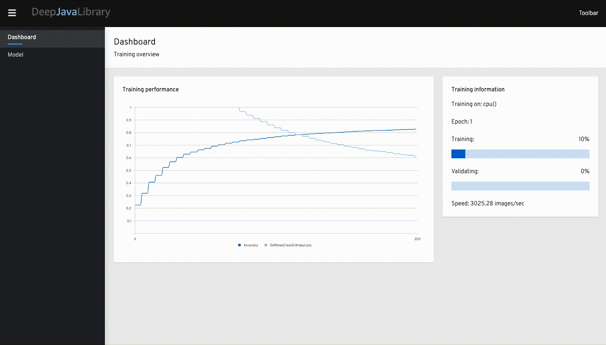

# Visualizing Training with DJL

This module contains UI TrainingListener that provides training visualization UI.

Currently implemented features:

- Training/Validating progress
- Training Metrics Visualization chart

## Prerequisites

* You need to have Java Development Kit version 11 or later installed on your system. For more information, see [Setup](../docs/development/setup.md).
* You should be familiar with the API documentation in the DJL [Javadoc](https://javadoc.djl.ai/api/0.4.0/index.html).

# How to

## Add the Deep Java Library UI dependency to your project.
  ```
        <dependency>
            <groupId>ai.djl</groupId>
            <artifactId>ui</artifactId>
            <version>0.5.0-SNAPSHOT</version>
        </dependency>
  ```

## Add UI Training Listener in a Training Configuration.
  ```
       .addTrainingListeners(new UiTrainingListener())
  ```


# Getting started: 30 seconds to run an example

## Build and install DJL UI

This component supports building with Maven (Gradle build WIP). To build, use the following command:

* Maven build
    ```sh
    mvn clean install -DskipTests -Pfrontend -f ui
    ```

## Build example project

To build, use the following command:

* Maven build
    ```sh
    mvn package -DskipTests -f examples

## Run example code

Run [Handwritten Digit Recognition](../examples/src/main/java/ai/djl/examples/training/TrainMnist.java) example

* Maven
    ```sh
    mvn exec:java -Dexec.mainClass="ai.djl.examples.training.TrainMnist" -f examples
    ```
  
## Open browser

Open http://localhost:8080 to get:



  